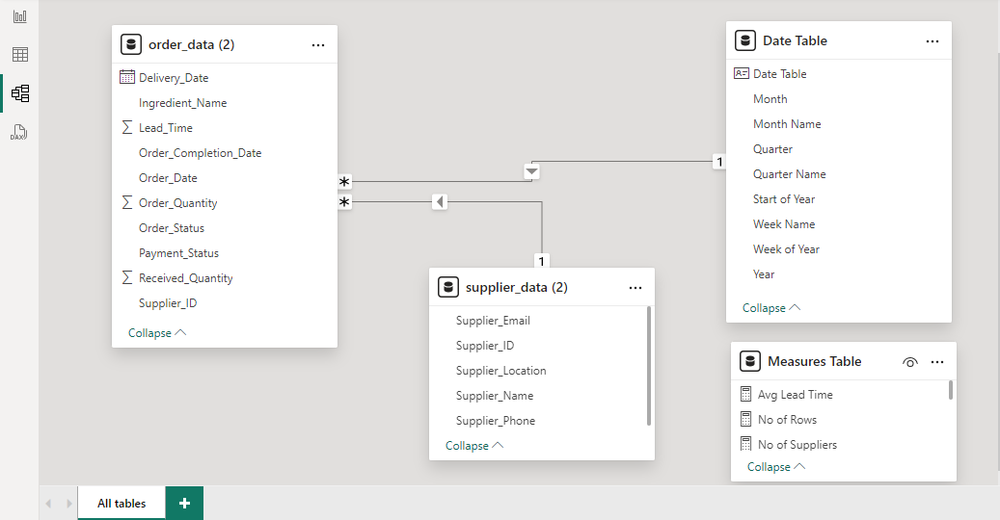
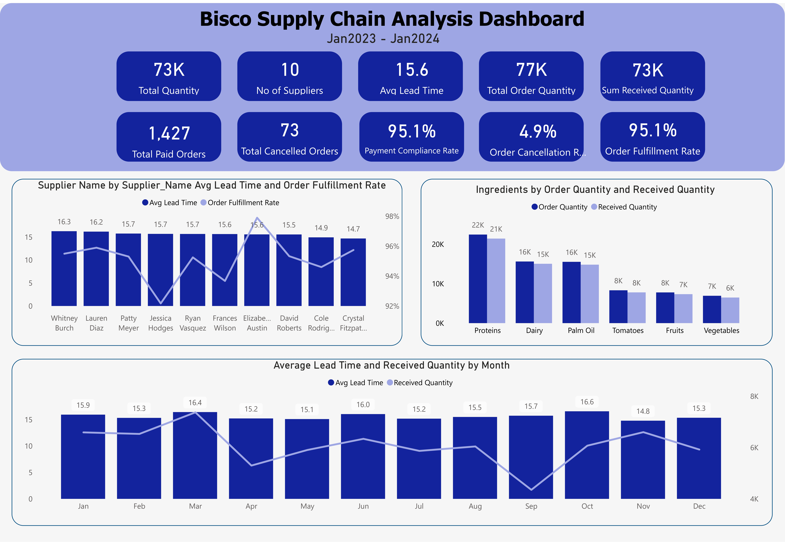
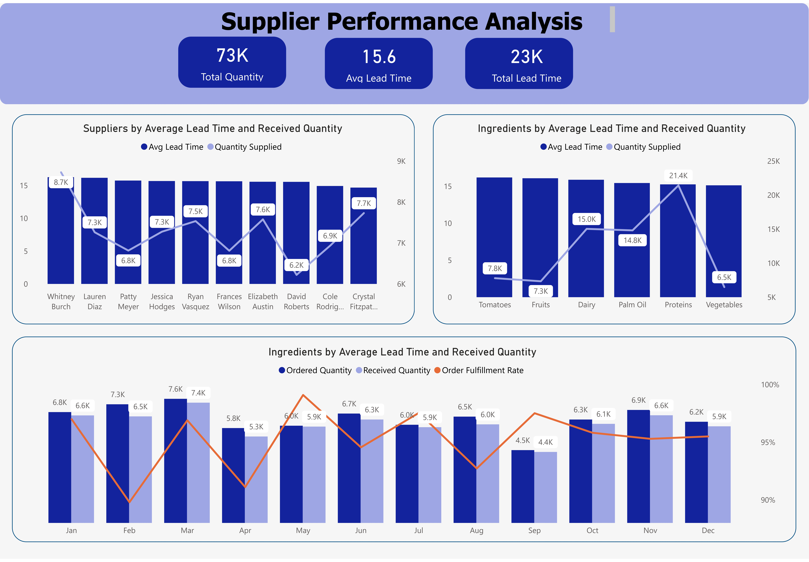
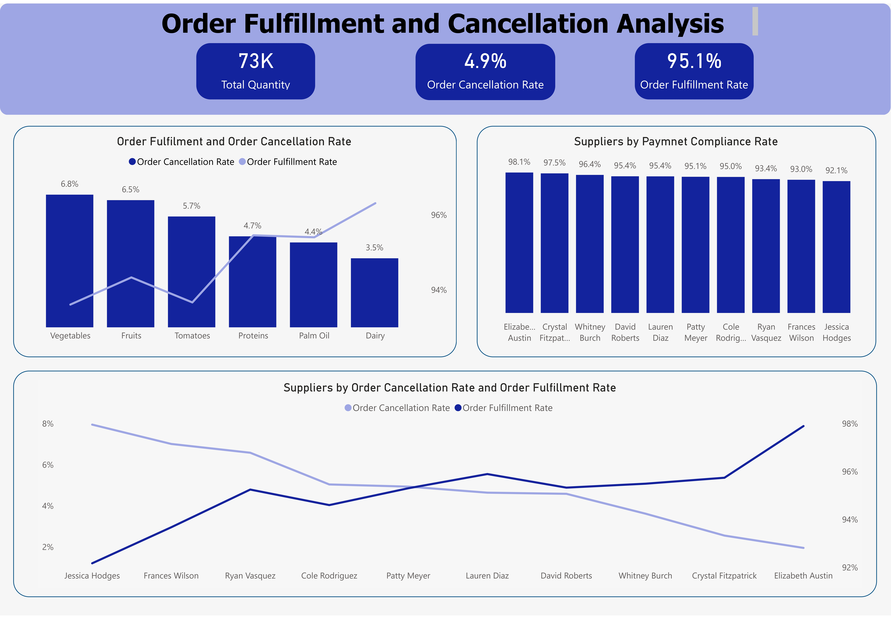

# Bisco Supply Chain Analysis

IMG

## Introduction

This is a power BI project on Supplier Performance analysis of an imaginary restaurant called **Bisco**. This project offers a deep dive into the complexities of sourcing, procurement, and supplier management, allowing me to understand how these elements impact the quality, cost, and efficiency of a restaurant's offerings.

Supply chain analytics focuses on improving the efficiency, transparency, and decision-making processes within the supply chain. It involves collecting, processing, and analyzing vast amounts of data related to supply chain operations, including sourcing, procurement, logistics, and supplier performance.

**_Disclaimer_**: __All datasets and reports do not represent any company, institution or country, but it is just a dummy dataset to demonstrate the capabilities of Power BI.__

### **Business Overview/Problem**

Bisco is known for its high-quality dishes and commitment to sourcing local ingredients. However, it faces a few key challenges that need to be addressed:

1. **Inconsistent Ingredient Quality**: The bistro relies on fresh, top-quality ingredients for its signature dishes. When the quality of ingredients from suppliers varies, it negatively affects the taste and presentation, impacting the overall dining experience.

2. **Delivery Delays**: Sometimes, ingredients are delivered late, which disrupts the kitchen’s operations and makes it hard to stick to the meal preparation schedule.

3. **Cost Fluctuations**: Prices from different suppliers keep changing, making it difficult to manage ingredient costs and maintain profitability while ensuring high quality. This creates challenges in maintaining stable prices for customers.

### **Project Aim**

Bisco wants to improve how it manages supplier performance in its supply chain to ensure it continues delivering great dining experiences and maintaining its reputation. The project focuses on three main goals:

1. **Consistent Ingredient Quality**: Bisco aims to ensure the ingredients used in its dishes are always of high quality. This project will help identify suppliers who consistently meet the restaurant's standards.

2. **Timely Deliveries**: The restaurant seeks to reduce delivery delays to keep kitchen operations running smoothly and provide excellent service to customers. This involves improving supplier scheduling and logistics.

3. **Cost Efficiency**: While maintaining quality, the project also aims to manage ingredient costs more efficiently. The goal is to find suppliers who offer both quality ingredients and competitive pricing to help the restaurant stay profitable.

### **Data Description**

Bisco has data on 1,500 orders from 10 suppliers, which will be analyzed to uncover useful insights. The data includes two key types:

1. **Supplier Data**:
   - **Supplier_ID**: Unique ID for each supplier.
   - **Supplier_Name**: Name of the supplier.
   - **Supplier_Email**: Supplier's email address.
   - **Supplier_Location**: The city or location where the supplier is based.
   - **Supplier_Phone**: Supplier's phone number.
   - **Payment_Terms**: The agreed payment method, like Transfer or Cash on Delivery.

2. **Order Data**:
   - **Supplier_ID**: Unique ID of the supplier for each order.
   - **Order_Date**: Date the order was placed.
   - **Delivery_Date**: Date the order was delivered.
   - **Lead_Time**: Number of days between placing and receiving the order.
   - **Order_Quantity**: Amount of ingredients ordered.
   - **Received_Quantity**: Amount of ingredients received.
   - **Order_Status**: Status of the order (e.g., "Paid" or "Cancelled").
   - **Payment_Status**: Whether the payment was completed or cancelled.
   - **Order_Completion_Date**: Date when the order was finalized.
   - **Ingredient_Name**: Name of the ingredient that was ordered.

### **Project Scope**

1. **Data Import**: Import data into the Power BI environment from its source.

2. **Data Cleaning & Transformation**: Clean and transform the data in Power BI for analysis.

3. **Data Analysis**: Analyze the data to identify trends, distributions, and correlations in supplier performance.

4. **Dashboard Creation**: Create interactive Power BI dashboards to track supplier performance metrics in real-time.

5. **Recommendations & Action Plan**: Provide actionable insights and recommendations to improve supplier performance.

### **Modelling**

### **Visualization**

This report consists of 4 Pages:
1. Dashboard
2. Supplier Analysis
3. Order Analysis
4. Insights and Recommendations

### **INSIGHTS**

1. Order Fulfillment Rate: The overall order fulfilment rate is high at 95.1%, indicating efficient delivery of orders.

2. Order Cancellation Rate: The cancellation rate is 4.9%. This suggests the need for further investigation to identify why orders are being cancelled.

3. Ingredient-Specific Insight: Vegetables have the highest cancellation rate, pointing to possible quality or supply issues that need to be addressed.

4. Supplier Payment Compliance: 

   - Highest Compliance: Elizabeth Austin has the highest payment compliance rate at 98.1%.

   - Lowest Compliance: Jessica Hodges has the lowest at 92.1%, signalling a potential area for improvement in supplier management or contract renegotiation.

5. Lead Time Overview: The overall lead time is long, with a total of 23,000 days and an average of 15.6 days per order.

6. Lead Time by Supplier: Whitney Burch has the highest lead time, indicating possible inefficiencies or logistical issues, especially given the large number of ingredients supplied.

7. Lead Time by Ingredient: Tomatoes have a significantly longer lead time and a lower quantity supplied compared to other ingredients, suggesting the need for better forecasting or improvements in the tomato supply chain.

8. Order vs. Received Quantity: There’s a gap of 3,000 units between the ordered quantity (77,000) and the received quantity (73,000), highlighting a discrepancy that requires attention.

9. Supplier Count: The company relies on a limited number of suppliers (10), which poses a risk. If one supplier fails to deliver, it could disrupt the supply chain. Diversification may be beneficial.

10. Supplier Performance: While overall fulfilment rates are good, suppliers like Jessica Hodges and Frances Wilson have lower rates, warranting closer attention.

11. Monthly Trends: There's a noticeable drop in received quantities in April and September, which should be investigated to prevent operational disruptions.

### **RECOMMENDATIONS**

1. Address Vegetable Supply Chain Issues: Engage with suppliers to resolve the high cancellation rates for vegetables, possibly by adjusting sourcing strategies.

2. Investigate High Lead Times: Look into the reasons behind extended lead times, particularly for tomatoes, and consider alternative suppliers or better forecasting methods.

3. Diversify Suppliers: Reduce the risk of relying on a small number of suppliers by exploring opportunities to diversify, ensuring a more resilient supply chain.

4. Work with Low-Performing Suppliers: Collaborate closely with suppliers like Jessica Hodges and Frances Wilson to understand and improve their fulfilment rates.

5. Manage Seasonal Demand: Investigate the drop in received quantities in April and September, and adjust inventory planning to avoid any operational impact during those months.
